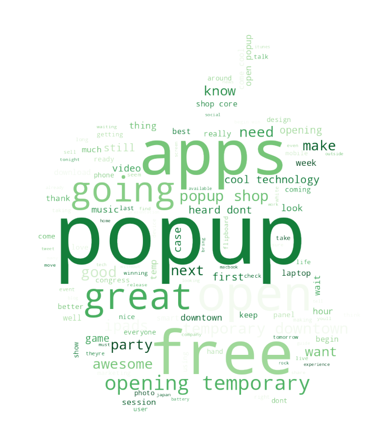
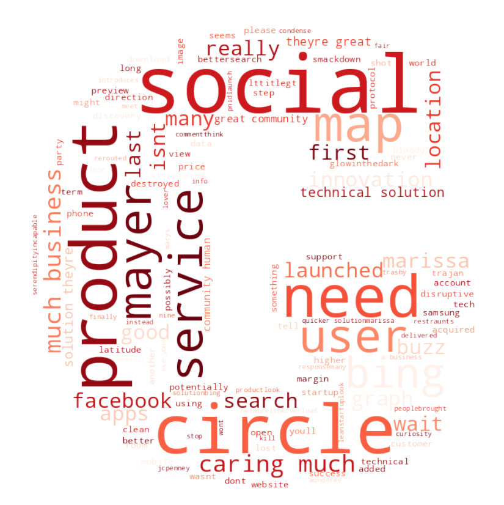

# SXSW Sentiment Analysis

## Overview


## Business Problem

South by Southwest (SXSW) is an annual conference in Austin, TX where creative industries converge to showcase innovations in technology and the creative arts, attended by tens to hundreds of thousands of people. The company that organizes it, SXSW LLC may be able to enhance the experience of attendees by analyzing their sentiments from posts shared online during past conference. Doing so will allow the organizers to gain an understanding of the public opinion behind certain events and companies that they features. Using public Twitter data, I describe patterns and topics that emerge and detect negative, neutral, and positive sentiments from thousands of tweets.

## Data Understanding

The Twitter dataset ([data file](https://github.com/czarinagluna/sxsw-sentiment-analysis/tree/main/data)) is composed of over 9,000 tweets about SXSW 2011 labeled as `negative`, `positive`, or `no emotion`. The tweets are the independent feature used to predict the multiclass sentiments. One other feature on the dataset is `emotion_in_tweet_is_directed_at`, which identifies Apple and Google products mentioned in the tweets. However almost 6,000 of the tweets are missing the product values, and so the feature will not be used later.

### Natural Language Processing

- Basic Cleaning and Tokenization
    - Standardization by lowercasing everything
    - Remove special characters such as punctuation
    - Tokenize to split the string into a list of words
- Lemmatization and Stopwords
    - Remove stopwords and other words specific to SXSW __**__
    - Lemmatizate to reduce each word to its most basic form
- Vectorization
    - Convert text data to word vectors

__**__ *To reduce the dimensionality of the data down to only the words that contain important information.*

```
# Example
RT @mention Mayer: 20% of Google searches are for local information #SXSW ^pr

# Result
['mayer', 'search', 'local', 'information']
```

### Data Visualization

To highlight significant textual data points, the data visualization technique `WordCloud` is used, which represents text data and indicates frequencies by the size of the words.



Positive sentiments about Apple such as the `pop-up` store at the conference. 


Negative sentiments toward Apple such as Kara Swisher's line `Apple is a fascist company` during an [interview](https://www.theguardian.com/technology/pda/2011/mar/13/flipboard-sxsw-2011) which was quoted all over Twitter. 


Positive sentiments about Google such as `Marissa Meyer` who was a keynote at the conference.



Negative sentiments toward Google such as the words `caring much` mentioned by Tim O'Reilly in one of the opening sessions. The [quote](https://www.forbes.com/sites/davidewalt/2011/03/11/tim-oreilly-speaks-at-sxsw/?sh=16c5913721ec) for context:
> I think that Google lost its way by trying to care too much for its business as opposed to caring about their users and their value to the world. And Larry [Page] has that.

## Data Modeling

The classification models used are Logistic Regression, Multinomial Naive Bayes, Decision Tree, Random Forests, Extra Trees, and Gradient Boost classifier. The class imbalance is addressed using random oversampling which randomly duplicates examples of the minority classes in the training set. To optimize the models, a grid search ([notebook](https://github.com/czarinagluna/sxsw-sentiment-analysis/blob/main/gridsearch.ipynb)) is performed to tune their hyperparameters.

### Classification Models

**Model Performance**


The Support Vector Machine for classification reaches the best cross validation score of 0.8726 followed closely by the Extra Trees with only 0.0024 difference, but the final evaluation on the test set shows that the Tuned Extra Trees classifier attains the highest score of 68.5% accuracy.

### Clustering Analysis

Clustering text documents using the K-Means clustering algorithm is completed on a separate notebook ([link](https://github.com/czarinagluna/Twitter-Sentiment-Analysis/blob/main/Clustering.ipynb)). The words are vectorized using the `Word2Vec` model and to reduce dimensionality, Principal Component Analysis `PCA` is applied to the word vectors, which are then stored in a dataframe with the $x$ and $y$ values. Using the open source data mining toolkit [Orange](https://orangedatamining.com/), I explore a range of different $k$ values and visualize them in the separate notebook ([link](https://github.com/czarinagluna/Twitter-Sentiment-Analysis/blob/main/Clustering.ipynb)).

Here, I set the number of clusters to 6:


Sample silhouette scores:

|  | x_values | y_values | count | word | Cluster | Silhouette |
|---:|---:|---:|---:|---:|---:|---:|
| 71 | 4.232746 | -0.236558 | 1528.0 | store | C1 | 0.500000 |
| 122 | 3.200685 | 3.263005 | 683.0 | launch | C3 | 0.688537 |
| 124 | 3.783673 | 4.306313 | 663.0 | social | C3 | 0.702629 |
| 36 | 4.860034 | -0.365946 | 598.0 | android | C5 | 0.577045 |
| 127 | 3.717602 | 4.206253 | 587.0 | circle | C3 | 0.709477 |

Cluster `WordClouds`


Clustering shows interesting results. For instance, Cluster 3 contains the exact words describing a major event "possibly today" that was supposedly the launch of Google's major social network called Circles but which did **not** actually happen at the conference, and yet talked about all over Twitter. 

## Results and Recommendations

**Confusion Matrix**


Comparing the confusion matrices of the models above, the final model that performs best is the **Multinomial Naive Bayes**. Though the Extra Trees classifier has a higher accuracy, it performs worse on the specific tasks of detecting negative and positive sentiments. 

- The misclassification of negative sentiments can be *more costly* to the conference organizers and companies featured at the events if more negative sentiments are spread online and missed. 
- The correct classification of positive sentiments can be more beneficial to understand and provide satisfaction to the attendees.


The **Final Model** increases the number of True Negatives from the baseline model by half to 57% and the number of True Positives to 62% which are the highest among all the other models. 

**Recommendations** 

- Detect sentiments during the conference using the machine learning model to predict positive and negative sentiments. Positive sentiments can be shared and negative sentiments can be addressed by responding to the concerns.
- Present findings to the companies at the conference to receive feedback about their products and to provide better services the next year. Marketing for Google Circles can use the excitement and speculation during the conference for example.
- Speakers at the conference can drive positive and negative sentiments so take advantage of the remarks that people talk about and use them to increase user engagement.

***
SOURCE CODE: [Main Notebook](https://github.com/czarinagluna/sxsw-sentiment-analysis/blob/main/main.ipynb)

# Contact

Feel free to contact me for any questions and connect with me on [Linkedin](https://www.linkedin.com/in/czarinagluna/).
