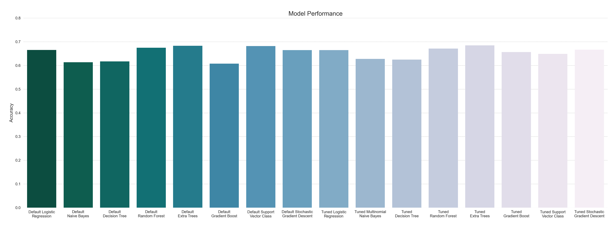
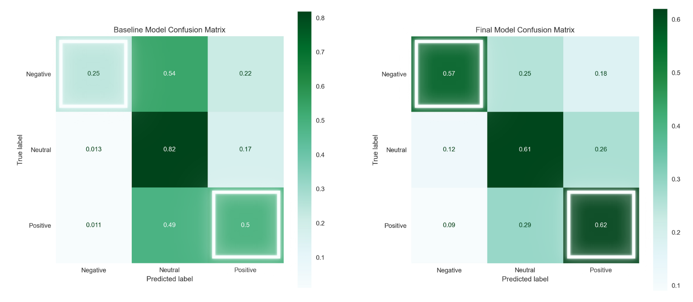

# SXSW Sentiment Analysis

## Overview

An analysis and natural language processing of thousands of tweets is completed to predict sentiments during SXSW and provide insights to brands and products at the conference. Though the extra trees classifier has the highest test accuracy, the Multinomial Naive Bayes model performs the best at classifying negative and positive sentiments. Clustering analysis is performed to identify themes and topics that emerged, and recommendations are made accordingly.


## Business Problem

South by Southwest (SXSW) is an annual conference where creative industries converge to showcase innovations in technology and the creative arts. The company that organizes the conference may be able to enhance customer experience by detecting and understanding sentiments of the attendees from past conference. Doing so will allow them to gain an understanding of the public opinion about events and brands featured at the conference. Using Twitter data I describe patterns and topics that emerge about the conference and Apple and Google products in particular at the SXSW 2011.

## Data Understanding

The Twitter dataset ([file](https://github.com/czarinagluna/sxsw-sentiment-analysis/tree/main/data)) contains over 9,000 tweets shared during the SXSW 2011 and labeled as `negative`, `positive`, or `no emotion`. To predict the multiclass sentiments NLP is applied to the text data for processing and analysis of the tweets:

### Natural Language Processing

- Basic Cleaning and Tokenization
    - Standardization by lowercasing everything
    - Remove special characters such as punctuation
    - Tokenize to split the string into a list of words
- Lemmatization and Stopwords
    - Remove stopwords and other words specific to SXSW __**__
    - Lemmatizate to reduce each word to its most basic form
- Vectorization
    - Convert text data to word vectors

__**__ *To reduce the dimensionality of the data down to only the words that contain important information.*

```
# Example
RT @mention Mayer: 20% of Google searches are for local information #SXSW ^pr

# Result
['mayer', 'search', 'local', 'information']
```

***

To highlight significant textual data points, I use the data visualization technique `WordCloud` which represents the text data and indicates frequencies by the size of words:

- **Positive sentiments about Apple** such as the `pop-up` store at the conference.


- **Negative sentiments toward Apple** such as Kara Swisher's line `Apple is a fascist company` during an [interview](https://www.theguardian.com/technology/pda/2011/mar/13/flipboard-sxsw-2011) which was quoted all over Twitter.  


- **Positive sentiments about Google** such as `Marissa Meyer` who was a keynote at the conference.


- **Negative sentiments toward Google** such as the words `caring much` mentioned by Tim O'Reilly in one of the opening sessions. 


Full [quote](https://www.forbes.com/sites/davidewalt/2011/03/11/tim-oreilly-speaks-at-sxsw/?sh=16c5913721ec) for context:
> I think that Google lost its way by trying to care too much for its business as opposed to caring about their users and their value to the world. And Larry [Page] has that.


## Data Modeling

The **Classification Models** used are Logistic Regression, Multinomial Naive Bayes, Decision Tree, Random Forests, Extra Trees, Gradient Boost, Support Vector Machine, and Stochastic Gradient Descent classifier. To adress the class imbalance I perform random oversampling by randomly duplicating examples of the minority classes in the training set. Then a grid search ([notebook](https://github.com/czarinagluna/sxsw-sentiment-analysis/blob/main/gridsearch.ipynb)) is implemented to optimize the models by tuning their hyperparameters.

### Clustering Analysis

Text clustering is completed ([notebook](https://github.com/czarinagluna/Twitter-Sentiment-Analysis/blob/main/Clustering.ipynb)) using the **K-Means clustering algorithm**. First the text data is vectorized using the `Word2Vec` model. Then to reduce dimensionality Principal Component Analysis is fit to the word vectors. The dataframe with `x_values` and `y_values` is shown below. Lastly I use the open source data mining toolkit [Orange](https://orangedatamining.com/) to explore a range of different *k* values.

Here I set the number of clusters to 6:

|  | x_values | y_values | count | word | Cluster | Silhouette |
|---:|---:|---:|---:|---:|---:|---:|
| 71 | 4.232746 | -0.236558 | 1528.0 | store | C1 | 0.500000 |
| 122 | 3.200685 | 3.263005 | 683.0 | launch | C3 | 0.688537 |
| 124 | 3.783673 | 4.306313 | 663.0 | social | C3 | 0.702629 |
| 36 | 4.860034 | -0.365946 | 598.0 | android | C5 | 0.577045 |
| 127 | 3.717602 | 4.206253 | 587.0 | circle | C3 | 0.709477 |


**Silhouette Scores**

| Cluster | count | mean |
|---:|---:|---:|
| C1 | 1 | 0.500000 |
| C2 | 544 | 0.671562 |
| C3 | 8 | 0.694157 |
| C4 | 112 | 0.621268 |
| C5 | 60 | 0.598980 |
| C6 | 275 | 0.598727 |

***

Cluster `WordClouds`


Clustering shows interesting results. Cluster 3 for instance contains the exact words describing a major event that was supposedly the launch of Google's major social network called Circles "possibly today"—did *not* actually happen but still talked about a lot at the conference. 

## Results and Recommendations



Across the chart the Extra Trees classifier attains the best cross validation score of 87% and the highest above at 69% accuracy on the final evaluation using the test set.

***

Comparing the confusion matrices of the models, the final model that performs best is the **Multinomial Naive Bayes**. 


Though the Extra Trees classifier has a higher accuracy, it performs worse on the specific tasks of detecting negative and positive sentiments. 

- The misclassification of negative sentiments can be *more costly* to the conference organizers and companies featured at the events if more negative sentiments are spread online and missed. 
- The correct classification of positive sentiments can be more beneficial to understanding of the users to continue to provide satisfaction to them.

***

The **Final Model** increases the number of True Negatives from the baseline model by half to 57% and the number of True Positives to 62% which are the highest among all the other models:



### Recommendations

- Detect sentiments during the conference using the machine learning model to predict positive and negative sentiments. 
    - Positive sentiments can be shared and negative sentiments can be addressed by responding to the concerns.
- Present findings to the companies at the conference to receive feedback as a guide to provide better services for next year. 
    - Products such as Google Circles could use the excitement and speculation during the conference.
- Highlight the remarks that drive positive sentiments as predicted by the model using natural language processing. 
    - Quote the speakers to facilitate further discussion among attendees and increase user engagement.

***
SOURCE CODE: [Main Notebook](https://github.com/czarinagluna/sxsw-sentiment-analysis/blob/main/main.ipynb)

# Contact

Feel free to contact me for any questions and connect with me on [Linkedin](https://www.linkedin.com/in/czarinagluna/).
